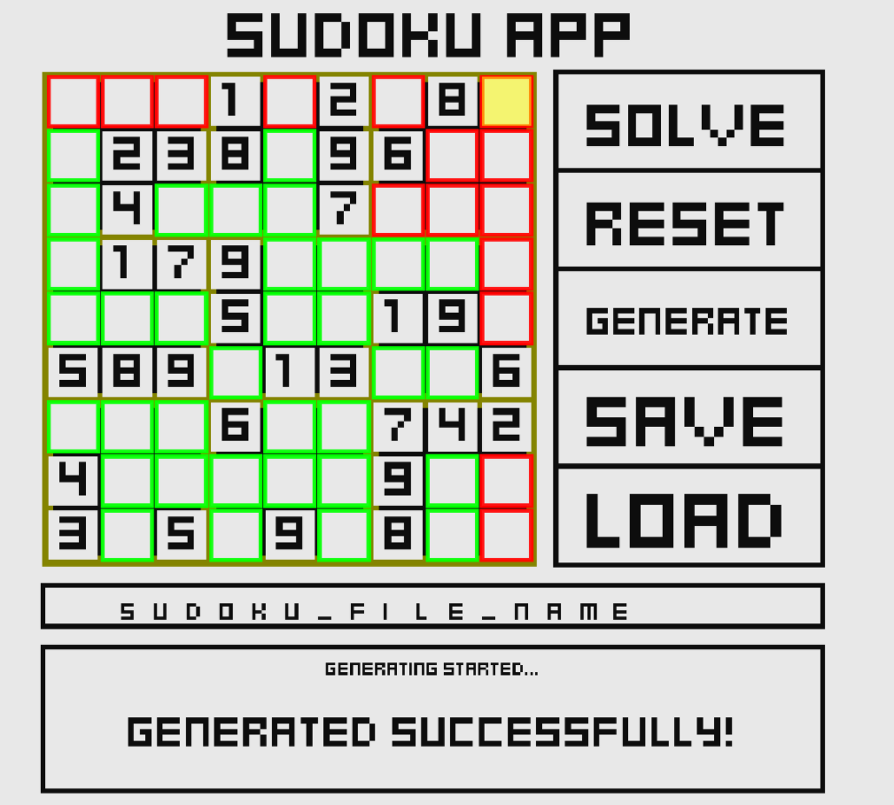
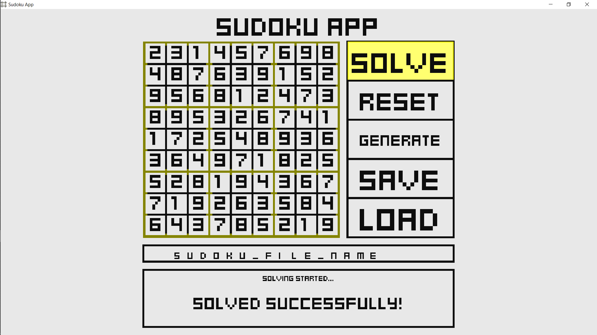
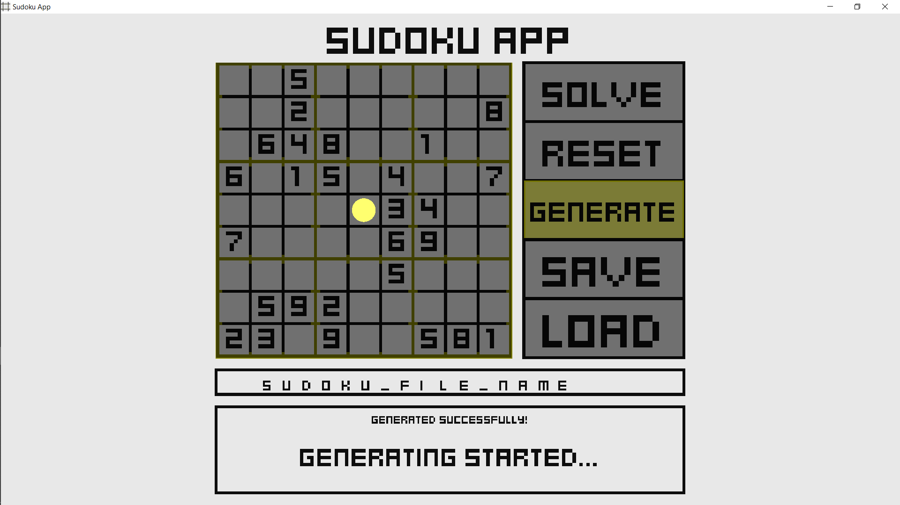
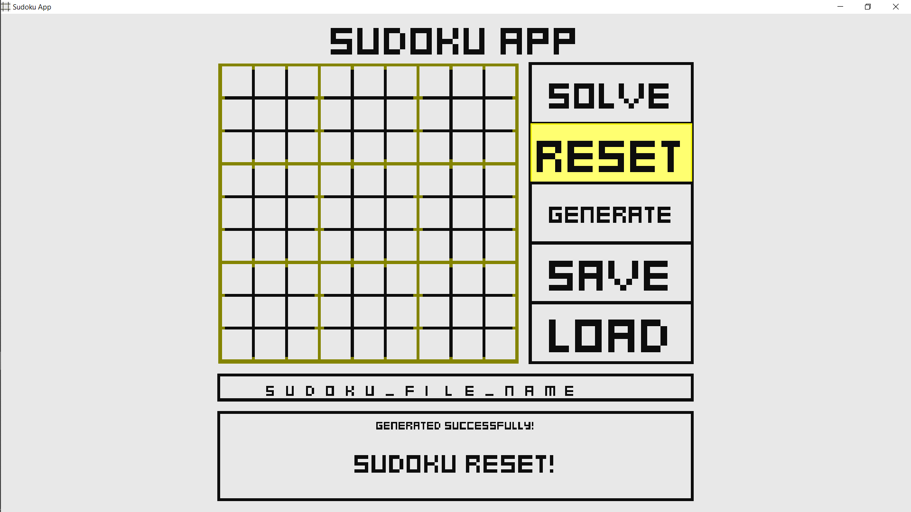
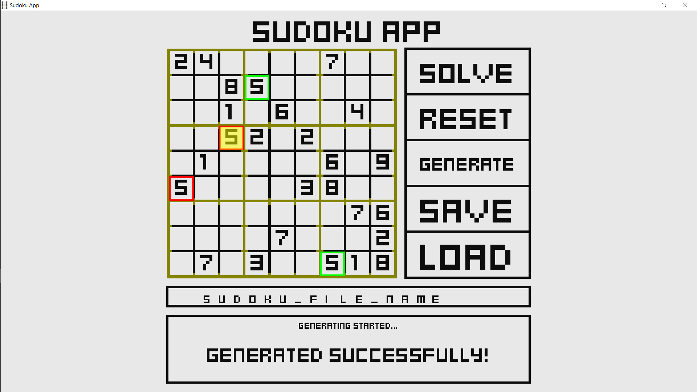
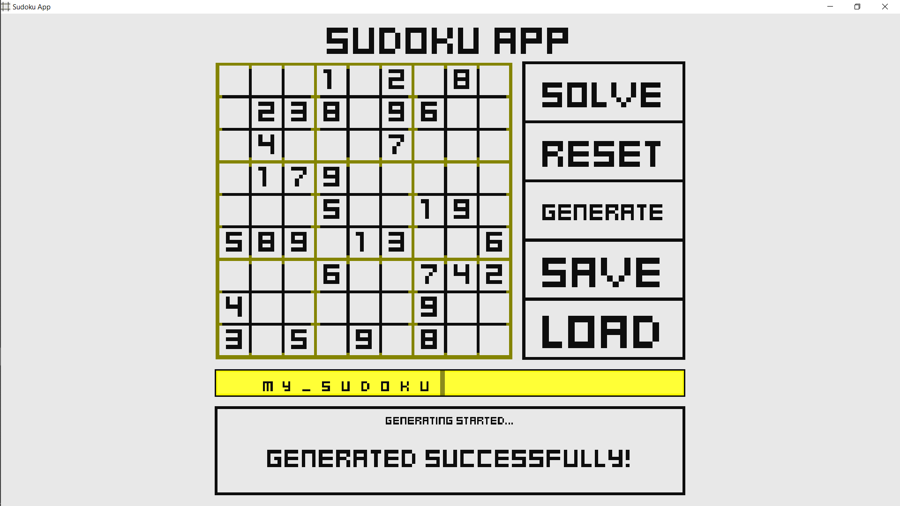



<h1 align="center"><strong>sudoku</strong></h1>

multipurpose sudoku application
 
<a href="https://github.com/paulinek13/sudoku/releases/"><strong>download »</strong></a>
 
 
<a href="https://github.com/paulinek13/sudoku/issues">request feature · report issue</a>
 
<a href="#about">about</a> ·
<a href="#contributing">contributing</a> ·
<a href="#credits">credits</a> ·
<a href="#changelog">changelog</a> ·
<a href="#screenshots">screenshots</a>
 
 

# About

This app lets you generate and solve sudoku as well as save/load sudoku to/from a file. There are also elements to help you solve sudoku on your own. It is written in C++ using [Allegro 5](https://github.com/liballeg/allegro5/) library.

# Contributing

Pull requests are welcome. _Any_ feedback is welcome as well.
For major changes, please open an issue first to discuss what you would like to change.

_more soon_

# Credits

- [Allegro 5](https://github.com/liballeg/allegro5/)
- [Kenney](https://kenney.nl/) (Font Mini Square)

# Changelog

- **v1.1** _2020-05-30_
  - switching font to more readable one
  - displaying only filled boxes
  - improving general readability
- **v1.0** _2020-05-19_
  - first release

# Screenshots

